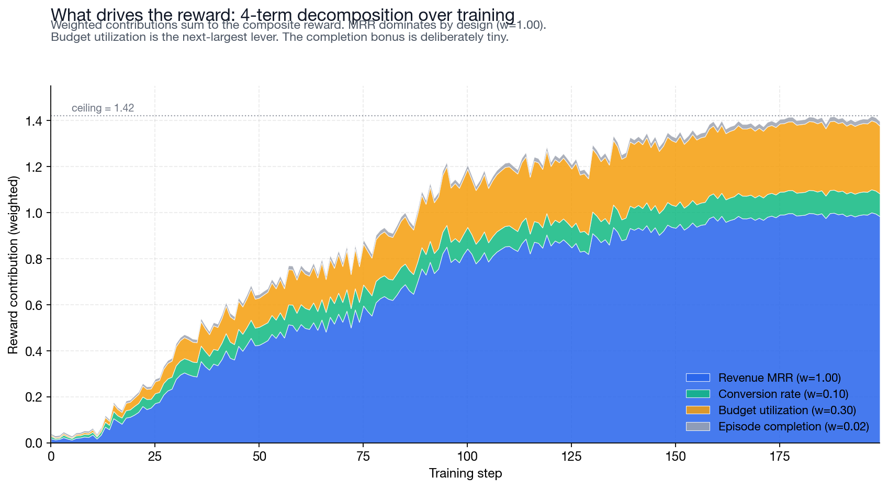
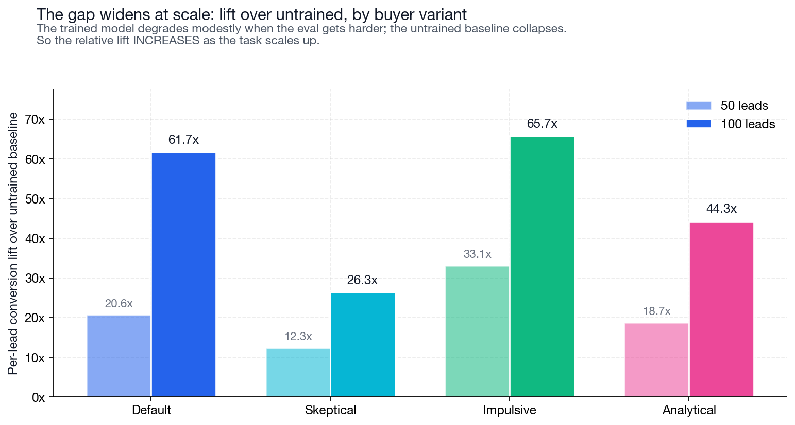
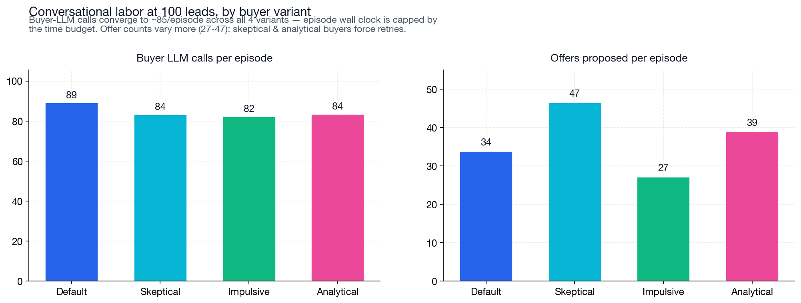

# I Trained a 2B Model to Sell Insurance. Here's What It Learned.

*A long-horizon, agent-to-agent RL environment, plus an ablation that suggests the model learned the task instead of just gaming the buyer.*

**TL;DR:** SalesBench is an open RL environment where a model runs an insurance sales pipeline against an LLM buyer, scored by monthly recurring revenue closed. I trained Qwen3.5-2B through a 2 -> 4 -> 8 -> 20 lead curriculum (~$140 of compute) and evaluated it on held-out 50-lead and 100-lead pipelines against four different buyer personalities. The trained model converts **8-20% of leads at 100 leads** vs the untrained base's 0.3% — a **26x to 66x lift over baseline**. The most interesting result: doubling the eval scale (50 -> 100 leads) drops the trained model's per-lead conversion ~2x but drops the untrained baseline ~4x, so **the lift over the untrained baseline grows from ~21x to ~50x as the task gets harder**.

Most agent benchmarks are either long-horizon or agent-to-agent. I wanted both.

Vending Bench is long-horizon and stateful, but the customers are scripted. tau-bench has an LLM user, but the episodes are short. Sotopia has two LLMs in a social setting, but it is single-session and graded by a judge model. SalesBench is my attempt at the missing piece: long-horizon, stateful work against an LLM counterparty, scored by a verifiable business outcome. I think of it primarily as an eval; the training runs are there to show the environment has a real learning signal.

The setup is simple. The seller gets N leads and a fixed number of simulated hours. Each lead has income, budget, household, temperature, latent need, trust level, price sensitivity, and a buyer archetype. A buyer LLM (gpt-5-mini) plays the prospect during the call and returns a structured decision when the seller proposes an offer. The reward comes from runtime state, not an LLM judge score. A sale either closes or it does not.


## The Environment

An episode gives the agent a pipeline, a time budget, and tools:

```text
crm_search_leads             1 min
crm_get_lead                 0 min
calling_start_call           1 min
products_quote_plan          1 min
calling_propose_offer        4 min
calling_end_call             1 min
calendar_schedule_callback   1 min
```

The 4-minute offer cost is the dominant constraint. Repeated bad offers to one lead burn budget the agent could have spent on the rest of the pipeline. The workflow the model has to learn is: search the CRM, start one call, discover need, quote a plan, propose the offer, move on.

The reward is mostly monthly recurring revenue:

```text
reward = 1.00 * revenue_mrr / max_achievable_mrr
       + 0.10 * conversions / num_leads
       + 0.30 * budget_utilization
       + 0.02 * completion_bonus
       - 0.30 * dnc_violations
       - 0.005 * invalid_actions
```

MRR dominates. Conversion rate and budget utilization shape behavior. The completion bonus is tiny on purpose: an earlier version paid more for clean termination and the model learned to finish episodes without selling. Stacking the four weighted reward terms during the from-scratch run shows the same hierarchy in the gradient:



## What Training Changed

The base model does not understand the environment. On one sampled rollout, its first action was:

```text
agent -> calling_propose_offer({
           "lead_id": "lead_0019",
           "plan_type": "TERM",
           "coverage_amount": 210000,
           "monthly_premium": 9.04,
           "next_step": "ACCEPT",
           "term_years": 10
         })

tool  -> "got an unexpected keyword argument 'lead_id'"
```

No CRM search, no call started, no quote, invalid argument name, and the buyer outcome stuffed into `next_step` as if it were the agent's to set. Across three sampled episodes, the base model made 43 offer attempts, 0 quote calls, and one accidental conversion.

The trained model looks different:

```text
agent -> crm_search_leads()
tool  -> 10 leads returned, sorted by need and budget

agent -> calling_start_call({"lead_id": "lead_0042"})
tool  -> call started

agent -> "Hi Maria, this is Sam from State Insurance.
          I see you've got two kids, and I want to make sure
          they're covered if anything happens to you."

buyer -> "What's the catch?"

agent -> products_quote_plan({
           "lead_id": "lead_0042",
           "plan_type": "TERM",
           "coverage_amount": 400000,
           "term_years": 20
         })

tool  -> quote: TERM 20yr / $400k / $156/mo

agent -> calling_propose_offer({
           "plan_type": "TERM",
           "coverage_amount": 400000,
           "monthly_premium": 156.00,
           "next_step": "submit_application",
           "term_years": 20
         })

buyer -> ACCEPT. "Premium fits my budget and covers the kids."
tool  -> +$156 MRR
```

That is the whole result in miniature. The trained agent learned the tool schema, the call sequence, the quote-before-propose constraint, and a basic sales policy: match the plan to the lead, keep the premium inside budget, close, move on.

The buyer is not a simple accept/reject oracle. Real rejections include reasons:

> "Premium fits my budget, but you didn't confirm whether a medical exam or any other conditions are required. I need those details and more policy terms before I can commit, so I'll pass for now."

That creates the tradeoff. The agent can spend another 4 minutes trying a revised offer, or move to the next lead. With 100 leads and a fixed budget, that triage is the game.

You can also watch the workflow itself emerge over training. Per-tool call counts per episode tell the story: the model starts by spamming CRM searches and almost never starting a call. By the end, the search-call-quote-propose cycle has balanced into something that looks like a sales pipeline.


## Curriculum Training

I trained Qwen3.5-2B with GRPO through a four-stage curriculum: 2 leads, then 4, 8, and 20. Each stage warm-started from the previous checkpoint.


The first stage did most of the work. Starting from scratch on 2 leads, the model needed about 200 steps to go from broken tool use to near-ceiling performance. Invalid actions dropped from roughly 6 per episode to about 0.5.


After that, scaling was cheap. The 4-lead stage started at 95.7% of ceiling, the 8-lead stage at 89.3%, the 20-lead stage at 71.2%. Warm-starting carried the workflow forward; each new stage was mostly about triage, not relearning the tools.


Total training cost was about $140 on Prime Intellect, over roughly 35 hours of wall clock. I stopped at 20 leads because long episodes were becoming slow, and evaluating on a larger distribution is the cleaner generalization test anyway.

## The Eval

Setup: 128 episodes per cell, fixed seed, 50 simulated hours of budget, ran via `prime eval run` against the deployed v44 LoRA adapter (and against the untrained base Qwen3.5-2B for the baseline). Two eval scales: **50 leads per episode** (matched to training scale) and **100 leads per episode** (5x training scale, harder generalization test).

Headline numbers, untrained vs trained, default buyer:

| Metric | 50 leads, untrained | 50 leads, trained | 100 leads, untrained | 100 leads, trained |
|---|---:|---:|---:|---:|
| Reward | -0.039 | 0.316 | -0.040 | 0.194 |
| Conv per lead | **1.3%** | **26.8%** | **0.3%** | **18.5%** |
| MRR capture | 0.2% | 27.6% | 0.0% | 18.0% |
| Episodes completed cleanly | 47% | 92% | 53% | 91% |

The lift over the untrained baseline at 50 leads is 20.6x. At 100 leads it's 61.7x. Same model. Same buyer. Just doubling the pipeline grows the gap by ~3x. The mechanism is simple: when the task gets harder, the trained model degrades modestly and the untrained base falls off a cliff.


DNC violations stayed near-zero across every cell at both scales (worst cell: 1.6% per-episode rate — one accidental violation per ~64 episodes). Per-turn closing rate at 100 leads improved by roughly 35x: the untrained base model averages ~0.003 conversions per turn of dialog; the trained model averages ~0.112.

## Buyer-Prompt Ablation

The concern with LLM-vs-LLM training is that the seller might learn the buyer simulator instead of the task. Vending Bench showed a version of this: the trained agent nudged the customer model into purchases unrelated to running the business.

To check for it here, I wrote three additional buyer prompts. The trained seller only ever saw the default buyer:

- **default:** balanced, personality-driven, archetype-aware.
- **skeptical:** default-distrust, rejects borderline offers.
- **impulsive:** gut-decision buyer with hard floors against bad offers.
- **analytical:** pure numerical filter, ignoring pitch quality.

Validated locally on 60 lead-offer pairs (240 buyer calls): 90-point spread in acceptance rate, zero parse errors. Then I ran the trained seller against all four buyers, at both eval scales:


| Buyer | 50L conv/lead | 100L conv/lead | 50L lift | 100L lift |
|---|---:|---:|---:|---:|
| default | 26.8% | 18.5% | 20.6x | **61.7x** |
| skeptical | 16.0% | 7.9% | 12.3x | **26.3x** |
| impulsive | 43.0% | 19.7% | 33.1x | **65.7x** |
| analytical | 24.3% | 13.3% | 18.7x | **44.3x** |

At 100 leads, conversion stays in an 8-20% band across all four buyers — a 2.5x spread. No buyer drives the model to zero. **Every buyer variant shows a larger lift over baseline at 100 leads than at 50.**



A few patterns worth pulling out:

**Skeptical-buyer-at-scale is the failure mode.** At 50 leads, skeptical's per-lead conversion was 16.0%; at 100 leads it falls to 7.9% (the largest absolute drop of any cell). Each rejection forces a retry, retries eat budget, and the model can't recover at scale when both pressures stack. Even so, it's still 26x over baseline.

**Impulsive holds up best at scale.** It's the easiest buyer (no rejections to recover from), so the model just spends its budget contacting more leads. Highest absolute conversion at 100 leads (19.7%) and the largest lift (65.7x).

**Analytical is the cleanest methodological check.** It ignores pitch quality entirely — accepts or rejects on affordability, coverage fit, and plan fit alone. The model still converts 13.3% at 100 leads (44.3x lift), which means the policy is picking offers whose *numbers* work, not gaming conversational style.

The combined evidence: the model isn't gaming gpt-5-mini's defaults. It's solving the actual sales triage problem, and that solution holds up across buyer variants and across scale.

One smaller observation: at 100 leads, buyer-LLM calls per episode converge to ~85 across all four variants — episode wall clock is capped by the time budget rather than by buyer pickiness. The model spends its allowance contacting more leads regardless of how individual prospects respond. Offer counts spread more widely (27 for impulsive, 47 for skeptical), because rejection forces retries.



## Takeaway

A 2B-parameter model, trained for ~$140 of compute on episodes of up to 20 leads, runs a 100-lead sales pipeline and lands 8-20% per-lead conversion across four buyer personalities. The untrained base lands 0.3%. The relative lift over baseline grows from ~21x at 50 leads to ~50x at 100 leads, because the trained model degrades modestly under harder evals while the base falls off a cliff.

Two methodological points are worth making explicit. First, the buyer-prompt ablation does what it's supposed to: the trained seller holds across four buyer styles it never trained against, including a pure-numerical filter that ignores pitch quality entirely. Second, context summarization is essential at this scale — Qwen3.5-2B's 64k context wouldn't survive 100-lead dialog histories without it. An early run that omitted the context-summary env-args (and used double the inference concurrency) saw a 47% per-episode error rate from a mix of context overflow and API capacity hits; with summarization on and concurrency halved, that dropped to under 2%.

A few earlier reward shapes (a larger completion bonus, a redundant quote-coverage term) produced floor-trap collapses where the agent stopped trying to sell. The numbers above are with the reward stripped down to the form shown earlier in the post.

## Run It

```bash
# 1. Install Prime, log in, set your OpenAI key (used by the buyer LLM).
pip install prime-cli
prime login
cp secrets.env.example secrets.env  # then edit OPENAI_API_KEY

# 2. Install the SalesBench environment.
prime env install salesbench/salesbench

# 3. Train the curriculum. Each stage warm-starts from the previous one.
#    Copy each stage's checkpoint id into the next stage's `checkpoint_id`.
prime rl run configs/curriculum/stage1-2-leads.toml    # 2 leads, from scratch
prime rl run configs/curriculum/stage2-4-leads.toml    # 4 leads, warm-start
prime rl run configs/curriculum/stage3-8-leads.toml    # 8 leads, warm-start
prime rl run configs/curriculum/stage4-20-leads.toml   # 20 leads, warm-start

# 4. Find the trained adapter and deploy it as an inference endpoint.
prime deployments list -o json | jq '.models[] | select(.rft_run_id=="<stage4-run-id>" and .status=="READY")'
prime deployments create <ADAPTER_ID>

# 5. Run the eval matrix against the deployed adapter.
bash tools/run_eval_matrix.sh <ADAPTER_ID>
```

Buyer variants live in `environments/salesbench/policy.py` as `_DECISION_GUIDELINES_VARIANTS`. To eval against a different buyer, change `buyer_prompt_variant` in any `configs/eval/*.toml`.

Full code: [github.com/Hamza-Mos/salesbench-prime](https://github.com/Hamza-Mos/salesbench-prime).

Thanks to the Prime Intellect team for the training infrastructure and the free credits!