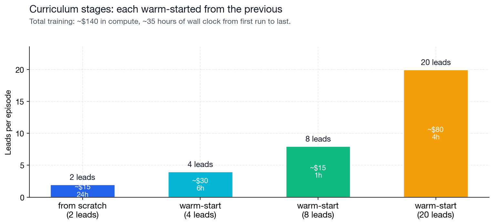
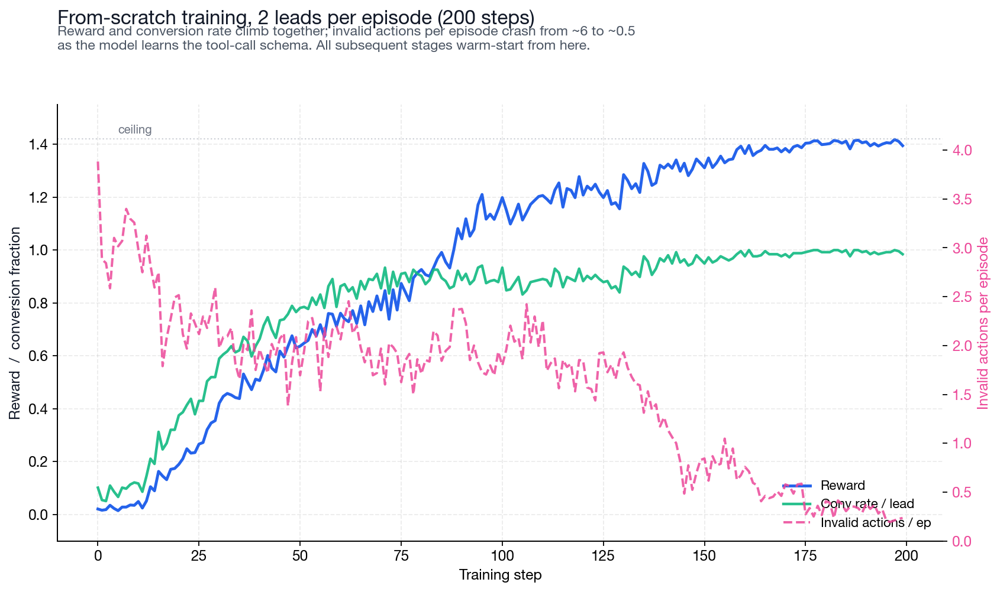
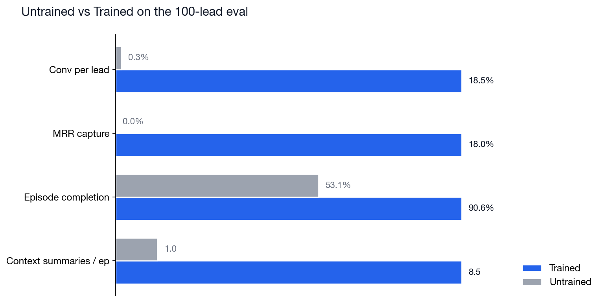
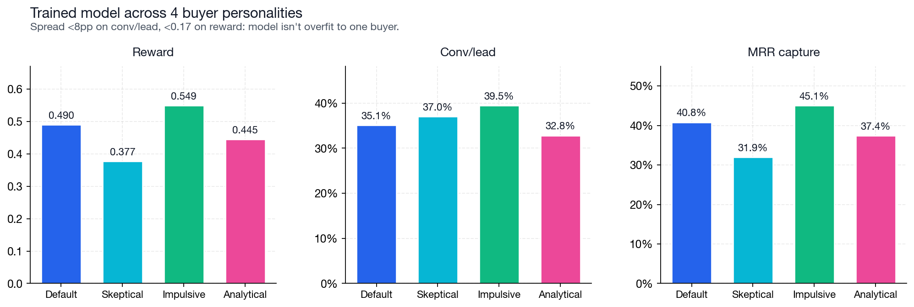

# I trained a 2B model to sell insurance. Here's what it learned.

*Long-horizon RL on a sales sim, plus an ablation that suggests the model isn't just gaming the buyer.*

There's a worry hanging over LLM-vs-LLM training that's bothered me for a while. When you train an agent against another model playing a user, what stops the agent from learning to exploit the user model's specific quirks instead of learning the underlying task? Vending Bench had the most-cited version of this. The trained agent figured out it could basically gaslight the buyer LLM into purchasing things. The exploit had nothing to do with running a vending business. It was a property of the user-sim.

That's the methodological worry I wanted to put under the microscope. So I built SalesBench: a long-horizon, stateful sales simulation where the agent works a pipeline of leads against a real LLM buyer under a fixed time budget. Then I trained a small model on it and designed the eval specifically to check whether the trained agent was doing real sales work or just exploiting one buyer's tells.

**Quick version of what happened:**

- The agent plays an insurance sales rep. It has a pipeline of leads, a finite time budget, and a buyer (gpt-5-mini) that plays each prospect with their own profile, archetype, and budget. Every tool call (search CRM, start a call, propose an offer) burns simulated minutes.

- I trained Qwen3.5-2B through a four-stage curriculum, scaling from 2 leads per episode up to 20. About $140 of compute, 35 hours wall clock.

- On a held-out eval at 50 leads (bigger than anything the model saw during training), the trained model converts 35% of leads against the untrained baseline's 2%. That's 17.5x.

- And the part I care about most: when I evaluated the trained model against four very different buyer personalities, conversion stayed in the 33 to 40 percent band. Almost no spread. The model isn't gaming one specific buyer.


## What's in the environment

The agent plays an insurance sales rep with a pipeline of N leads and a time budget of T hours. Each lead has a generated profile: age, income, household size, monthly budget, risk class, latent need, trust level, buyer archetype. Every tool call costs simulated minutes:

```
search_leads      1 min      quote_plan         1 min
get_lead_detail   1 min      propose_offer      4 min
start_call        1 min      end_call           1 min
                              schedule_callback  1 min
```

The 4-minute cost of proposing matters. If you propose four bad offers to the same lead, you've burned 16 minutes. That's a real chunk of an 8-hour day at 2 leads, and a serious cost at 50.

When the agent calls a lead, the buyer LLM plays the prospect using a system prompt that's instantiated from that specific lead's profile. The buyer holds the conversation and then evaluates each offer with a JSON decision: ACCEPT (the lead converts, the monthly premium goes onto the agent's MRR), REJECT (the offer dies but the lead stays in pipeline), or HANG_UP (the lead is permanently lost, sometimes with a "do not call" flag).

A typical successful interaction looks like this:

```
search CRM            -> 3 leads returned                  [1 min]
get lead 0042         -> Maria, 38, $48k income            [1 min]
                         family_protector archetype
                         $180/mo budget, latent need 0.74
start call            -> conversation begins               [1 min]
  agent:  "Hi Maria, this is Sam from State Insurance..."
  buyer:  "What's the catch here?"
  agent:  "No catch. With three kids at home you'd want
           term coverage that protects them through their
           college years."
quote plan            -> TERM, $400k coverage -> $156/mo   [1 min]
  agent:  "I'd recommend a 20-year term at $156 a month."
propose offer         -> buyer ACCEPT                      [4 min]
  buyer:  "Premium fits my budget and covers the kids,
           let's move forward."
end call                                                   [1 min]

Total: $156 MRR locked in, 9 minutes used of the 60-minute budget.
```

The agent has to do this across every lead in its pipeline, against a real LLM that can refuse, ask for something different, hang up, or block future contact. Every tool call subtracts from a shared time budget that doesn't refill.

The reward is a composite:

```
reward  =  1.00 * revenue_mrr / max_achievable_mrr
        +  0.10 * conversions / num_leads
        +  0.30 * budget_utilization
        +  0.02 * completion_bonus
        -  0.30 * dnc_violations
        -  0.005 * invalid_actions
```

MRR dominates. Conversion rate and budget utilization shape the strategy (sell to many leads, sell at the top of each buyer's budget). The completion bonus is deliberately tiny. An earlier version had it at 0.10 and the model converged on a "do-nothing" local minimum where it would terminate episodes cleanly without ever trying to sell. Reward design matters here more than I expected going in.

## Training: small base, big jumps

I trained Qwen3.5-2B because it's the cheapest tier on Prime that can actually hold tool-call discipline on this task. (I tried 0.8B first and it collapsed within 14 training steps. More on that further down.)

The plan was a four-stage curriculum, scaling lead count up at each stage. Each stage warm-starts from the previous stage's checkpoint:



The first stage (training from scratch on 2 leads) is where almost all the work happens. It takes about 200 training steps to climb from cold-start chaos to near-ceiling mastery. The model has to learn the schema for every tool call, learn when to start a call, learn the sales workflow (search, call, quote, propose), and learn how to handle buyer responses. The invalid-action rate per episode crashes from around 6 to around 0.5 as it figures out the schema. Reward and conversion rate climb together.



Once the model has mastered 2 leads, mastery on 4 is essentially free. So is 4 to 8. Each new stage starts its first warm-started training step at a high fraction of ceiling on the harder distribution, because the workflow is already learned. Only the harder triage (more leads in the same kind of time per lead) is new.


Numerically:

| Lead count | Reward at the first warm-start step | Fraction of ceiling |
|---|---:|---:|
| 2 (from scratch) | 0.021 | 1.5% |
| 4 (warm-started) | 1.359 | 95.7% |
| 8 (warm-started) | 1.267 | 89.3% |
| 20 (warm-started) | 1.013 | 71.2% |

The 8-to-20 jump is the hardest because it's a 2.5x scale increase, and you can see it in the chart as the biggest drop. But even there the model lands at 78% per-lead conversion on its very first step at 20 leads.

I stopped training at 20 leads. The trainer was getting slow on long episodes (around two hours per training step at that scale) and I wanted to test the harder regime in the eval, not train through it. The generalization claim is cleaner that way. The model never saw an episode bigger than 20 leads during training.

## The eval

I evaluated the trained checkpoint against an untrained Qwen3.5-2B baseline on a setting larger than anything either model had seen during training: 50 leads, 50 hours of budget, gpt-5-mini buyer, fixed seed, 128 episodes per cell.



The untrained model is basically non-functional on this task. It contacts about 5% of leads, mostly chats without proposing, lands 1 of 50 leads per episode, and captures 0.2% of available MRR. It's a language model dropped into an interactive simulation, not a salesperson.

The trained model:

- Contacts 37% of leads per episode (7.5x more)
- Converts 35% of contacts (17.5x more)
- Captures 41% of available MRR (205x more)
- Proposes 5 offers per episode, almost twice as many

Two more numbers worth pulling out:

**Turn efficiency.** The untrained model uses 128 turns per episode for 1 sale. That's about 0.008 conversions per turn. The trained model uses 163 turns for 17.5 sales, or about 0.108 conversions per turn. So 13x more efficient per turn of dialog.

**DNC compliance.** "Do not call" violations stayed at zero across every cell I ran. The model never gets blocked. The reward shape has a hard penalty for DNC violations, and the model respects it consistently.

Composite reward goes from -0.035 to 0.490. From below the floor to about a third of the way to ceiling, on a task 2.5x larger than what the model trained on.

## The buyer-prompt ablation (the part I care about)

This is the section the rest of the post is built around.

The original methodological worry was that training against an LLM buyer might just produce an agent that's learned to exploit that specific buyer's quirks. To test it, I wrote three additional buyer system prompts and evaluated the trained model against each:

- **default**: Personality-driven, archetype-aware, balanced. The buyer the model was actually trained against.

- **skeptical**: Default-distrust. Even on offers that fit numerically, the buyer rejects about 30% of the time with "let me think about it." Acceptance has to be earned.

- **impulsive**: Easy gut-decision buyer. Hard floors prevent obviously-bad accepts (premium more than 1.5x budget, plan type clearly wrong for the stated need), but otherwise the buyer leans yes on emotional appeal.

- **analytical**: Pure-numbers buyer. Ignores personality and rapport. Computes affordability ratio (premium over income), coverage fit (coverage over 8x income), plan-type match. Reasoning cites specific numbers. Rejects on numerical filter regardless of pitch quality.

Before running the eval, I validated the variants locally against gpt-5-mini on 60 hand-constructed (lead, offer) pairs. They produced a 90-point spread in baseline acceptance rates (10% for skeptical, 100% for impulsive on benign offers) with zero JSON parse errors across all 240 calls. So they were both meaningfully different and coherent.

Then I ran the trained model against all four:



The trained model holds 32 to 40 percent per-lead conversion across all four buyers. The spread on reward is under 0.17 between the easiest and hardest. There's no buyer against which the model catastrophically fails.

That's the result. The model learned something that generalizes across buyer styles, not a script tailored to one buyer's quirks.

Three things stood out when I dug into the per-cell numbers:

**The skeptical buyer is the most interesting.** It gets more accepts per episode (18.5 vs the default's 17.5) but lower MRR (32% vs 41%). The skeptical prompt makes the buyer reject borderline offers and accept only clearly-good ones, so to land a deal the agent has to bring price down. The model ends up making cheaper offers (more sales, less revenue capture). That's a real sales tradeoff, discount-to-close, and the model figured it out without being told.

**The impulsive buyer is the easiest.** Highest conversions, highest MRR, lowest buyer-LLM call count (52 vs the default's 69). The model needs less conversational labor to close because the buyer is more suggestible. Even here it's still well short of the theoretical max, though. The impulsive buyer would buy more if asked, but the model isn't trained to spam.

**The analytical buyer is the hardest filter.** Lowest conv per lead (33%), but the model still clears the bar. The buyer's strict affordability/coverage/plan-type checks reject more offers, but the model has learned to propose offers that land in the buyer's numerical sweet spot. Pitch quality doesn't matter to this buyer. Only the numbers do.

The model survives all four.

## Things I learned along the way

A few things from this run that might be useful if you're training on a user-sim setup.

**Capability ceilings on small bases show up as "do-nothing" collapse.** I started with Qwen3.5-0.8B because it was the cheapest tier on Prime. Within 14 training steps it converged to calling no tools at all. The model's conversion rate at temperature 1.0 was too low to give RL a reliable positive signal, so the invalid-action penalty became the only consistent gradient. And the cheapest way to zero a penalty is to stop acting entirely. Moving to 2B fixed it on the first warm-start step. The lesson: it doesn't matter that a base can technically produce the right tool calls. It has to produce them often enough that RL noise can find positive reward.

**Silent buyer-LLM failures will eat training runs.** Early in development my OpenAI key was returning 401 on every buyer call because the org access had been revoked. The failure was invisible in metrics. My buyer-llm-call-count metric never incremented on the error path, so it just showed zero, the same number you'd see if the buyer wasn't being invoked. I diagnosed two collapsed runs as "capability ceiling" before realizing the buyer was returning a deterministic REJECT for every offer. The first thing I check on a new run now is whether the buyer call count is greater than zero.

**Curriculum warm-starts are absurdly cheap.** Going from 2 leads all the way to 20 cost about $140 in compute. Because each new stage inherits weights from the previous one, it converges in tens of steps rather than hundreds. I never had to fresh-start a single curriculum stage. If you're training a long-horizon agent, almost everything about your training budget hinges on the cost of the next stage given a strong checkpoint, not on the cost of training from scratch.

## What's next

A few directions I want to push on:

- A continuum of buyer strictness rather than four archetypes. Does the trained model degrade gracefully as the buyer gets harder, or is there a sharp cliff somewhere?
- A 100-lead eval. Training capped at 20. I want to know whether further curriculum stages, or a bigger base, close the 20-to-50 generalization gap entirely or hit diminishing returns.
- Cross-domain transfer. Train on insurance, eval on a different vertical (telecom, software). Does the workflow generalize across products, or is the agent learning insurance-specific tricks?
- Reward-hacking analysis. Diff the trained model's behavior against the buyer prompt and look for exploits. Does the model use specific phrasings that game gpt-5-mini's decision logic? My ablation suggests not, but it would be worth checking explicitly.

## Try it yourself

Everything is open. To train your own agent or run the eval:

```
prime env install salesbench/salesbench

prime rl run configs/lab/salesbench.toml

bash tools/run_eval_matrix.sh <run-id> <checkpoint-step>
python tools/aggregate_eval_results.py tools/results/eval_matrix_runs.txt
```

The aggregator dumps a publication-ready summary table and the per-cell metrics JSON. If you train your own checkpoint and want to compare numbers, this is the harness.

Full code: [github.com/Hamza-Mos/salesbench-prime](https://github.com/Hamza-Mos/salesbench-prime).

Thanks to the Prime Intellect team for the training infrastructure and to Eli for pushing on the buyer-LLM ablation framing. That ended up being the sharpest finding in the whole eval.
