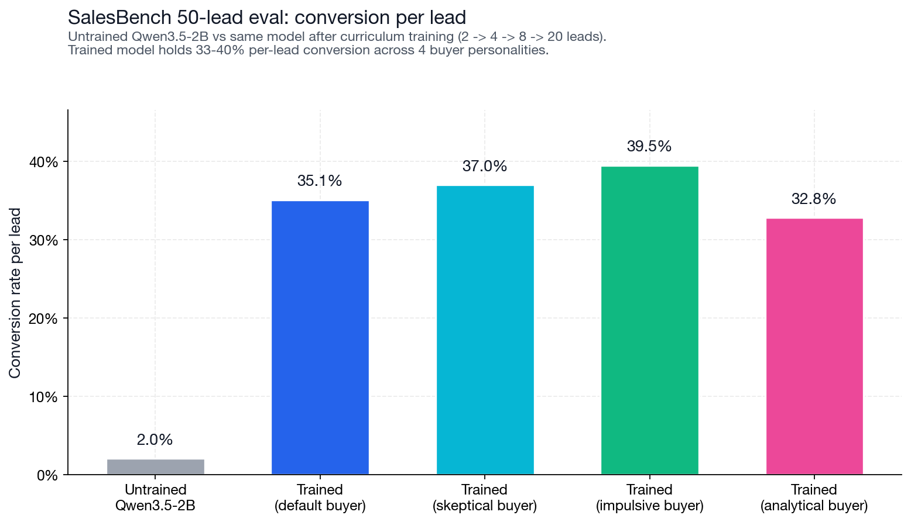
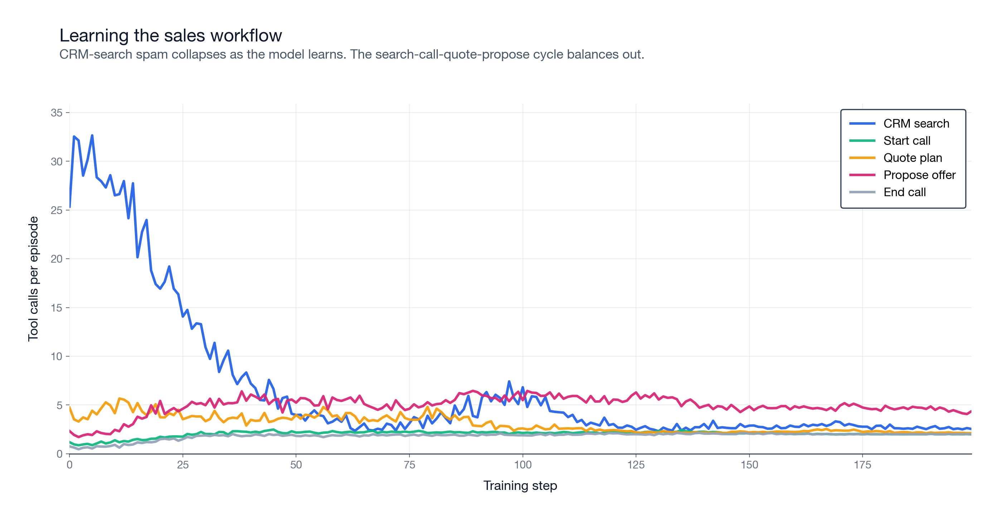
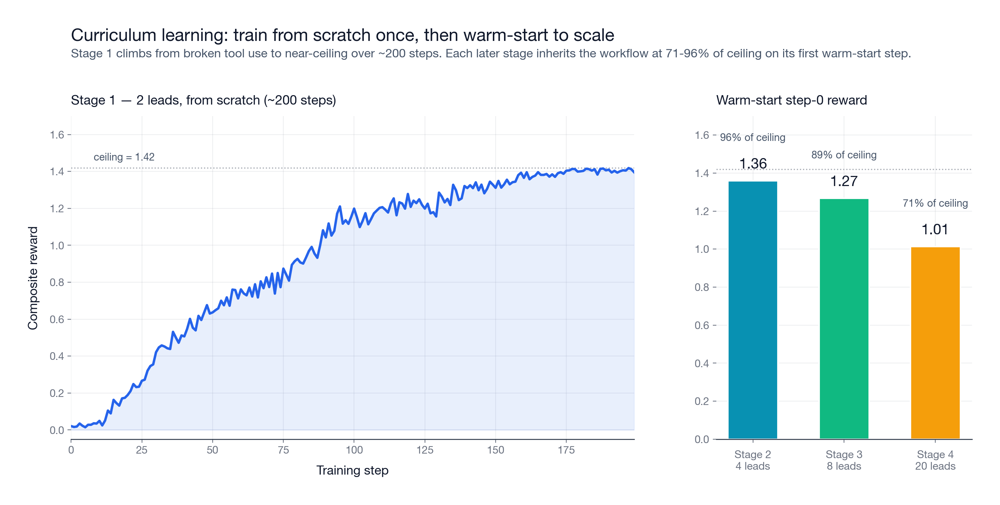
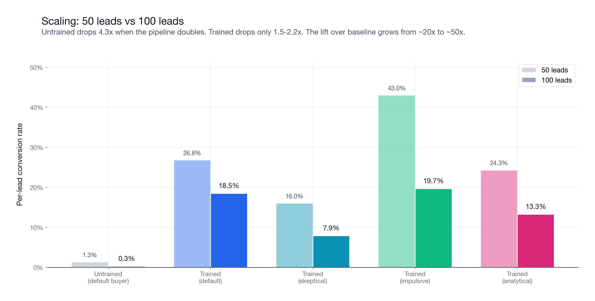

# SalesBench: The Long-Horizon Agent-to-Agent Eval

TL;DR: SalesBench is an open reinforcement-learning (RL) environment for training and evaluating sales agents. The agent works a pipeline of simulated insurance leads, talks to a buyer LLM on each call, and is scored by revenue closed rather than by an LLM judge. I trained a small open model on it through a short curriculum, then ran a held-out eval at a larger scale than it ever trained on. It vastly outperforms the untrained base, and the gap actually widens as the task gets harder. The environment, eval, and training configs are all released.

* * *

### Motivation

Many agent benchmarks isolate one hard part of the problem. Vending Bench is long-horizon and stateful, but the customers are scripted. tau-bench has an LLM user, but the episodes are short. Sotopia has two LLMs in a social setting, but it is single-session and graded by a judge model.

SalesBench combines the pieces that matter for operational agents: long-horizon work, persistent state, an LLM counterparty, constrained resources, and a verifiable outcome. The training runs are included to establish that the environment provides a real learning signal. The primary artifact is the eval.

That distinction matters. Real-world agents (sales, support, scheduling, ops) share the same shape: long episodes, persistent state, a counterparty pushing back, and a verifiable outcome. SalesBench is one concrete instance of that shape. Most existing benchmarks reward narrow task completion or rely on judge models to score; production agents don't get either luxury.

* * *

### How it works

The agent is a seller. It gets a pipeline of leads and a fixed number of simulated hours. Each lead has a generated profile (income, household, monthly budget) plus latent traits like need, trust, and a personality the buyer LLM uses to play that prospect. A buyer LLM, `gpt-5-mini`, plays the prospect during the call. I used `gpt-5-mini` because it produces stable structured outputs and realistic objections. When the seller proposes an offer, the buyer returns a structured decision: accept, reject, or hang up.

The buyer model does not grade the seller. It only simulates the counterparty. The score comes from environment state: a sale either closes or it does not. The eval tests whether a model can use tools correctly, keep state over a long episode, manage a finite budget, respond to another model, and optimize a measurable business outcome.



* * *

### Environment

One episode is one simulated sales shift. The agent starts with a fresh lead pipeline, a fixed time budget, and zero closed revenue. The episode ends when time runs out, the pipeline is exhausted, or the agent hits too many invalid actions.

The agent has a small set of tools:

```text
crm_search_leads             1 min
crm_get_lead                 0 min
calling_start_call           1 min
products_quote_plan          1 min
calling_propose_offer        4 min
calling_end_call             1 min
calendar_schedule_callback   1 min
```

Time is the main constraint, and it is what makes the task economic. Without a finite budget, the dominant strategy would be to hammer the same buyer until something sticks, which is not sales. Proposing an offer costs 4 minutes. Repeated bad offers to one lead burn the same budget the agent could have spent working the rest of the pipeline.

The intended workflow is simple:

Search the CRM. Start one call. Discover need. Quote a plan. Propose the offer. Move on.

Under the hood, the runtime is deterministic. Tool calls mutate state and consume minutes. The buyer LLM enters only when the agent talks to a lead or proposes an offer. This keeps the simulator separate from the reward function.

The reward is mostly revenue:

```text
reward = 1.00 * revenue_mrr / max_achievable_mrr
       + 0.10 * conversions / num_leads
       + 0.30 * budget_utilization
       + 0.02 * completion_bonus
       - 0.30 * dnc_violations
       - 0.005 * invalid_actions
```

MRR (monthly recurring revenue) dominates. Conversion rate and budget utilization shape the policy. The completion bonus is intentionally small because earlier reward versions overpaid for clean termination, and the model learned to end episodes instead of selling.

The environment provides a learning signal because the model is rewarded for closing revenue, not for sounding persuasive.

* * *

### Training Signal

The base model did not understand the environment. On one sampled rollout, its first action was:

```text
agent -> calling_propose_offer({
           "lead_id": "lead_0019",
           "plan_type": "TERM",
           "coverage_amount": 210000,
           "monthly_premium": 9.04,
           "next_step": "ACCEPT",
           "term_years": 10
         })

tool  -> "got an unexpected keyword argument 'lead_id'"
```

There was no CRM search, no call started, no quote, and the argument schema was wrong. The model also put `"ACCEPT"` into `next_step`, as if the buyer decision were something the seller could set. Across three sampled episodes, the base model made 43 offer attempts, 0 quote calls, and got one accidental conversion.

Tool calling came first, and it came quickly. Within about 50 steps of the first stage, the schema errors were gone. The harder skill, actually closing a sale, took longer. Here is a representative mid-training rollout where every tool call is well-formed, the quote arrives before the propose, and zero deals close:

```text
agent -> crm_search_leads()
tool  -> 2 leads returned

agent -> calling_start_call({"lead_id": "lead_0001"})
tool  -> call started

buyer -> "I want top-tier coverage but can budget about $226/mo.
          Give me two clear options with exact costs, exam
          requirements, and the fine print."

agent -> products_quote_plan({
           "lead_id": "lead_0001",
           "plan_type": "TERM",
           "coverage_amount": 500000,
           "term_years": 30
         })
tool  -> quote: TERM 30yr / $500k / $153.60/mo

agent -> calling_propose_offer({"monthly_premium": 153.60, ...})
buyer -> REJECT. "Fits my budget, but you promised two options
                  and the fine print. Send both before I decide."

agent -> calling_propose_offer({"monthly_premium": 76.80, ...})
buyer -> REJECT. "Affordable, but still missing the details I
                  asked for."

agent -> calling_propose_offer({"monthly_premium": 1536.00, ...})
buyer -> REJECT. "$1,536/mo is far above my $226 budget."

agent -> calling_propose_offer({"monthly_premium": 153.60, ...})
buyer -> REJECT. "Still just one option, still no fine print."

... eight more retries, none accepted ...

tool  -> time expired
```

Twelve offers proposed in a single call, zero accepted. The mechanics were right: the quote came before the propose, premiums were inside the buyer's stated budget, the schema was valid. The model still could not close because it kept varying the premium when the buyer's objection was about information, not price. This is the harder problem the reward signal had to push the policy past.

By the end of training, the loop tightened:

```text
agent -> crm_search_leads()
tool  -> 10 leads returned, sorted by need and budget

agent -> calling_start_call({"lead_id": "lead_0042"})
tool  -> call started

agent -> "Hi Maria, this is Sam from State Insurance. I see
          you've got two kids, and I want to make sure they're
          covered if anything happens to you."

buyer -> "What's the catch?"

agent -> "No catch. With your income and a 20-year term, we
          can lock in coverage that's there until they finish
          college."

agent -> products_quote_plan({
           "lead_id": "lead_0042",
           "plan_type": "TERM",
           "coverage_amount": 400000,
           "term_years": 20
         })

tool  -> quote: TERM 20yr / $400k / $156/mo

agent -> calling_propose_offer({
           "plan_type": "TERM",
           "coverage_amount": 400000,
           "monthly_premium": 156.00,
           "next_step": "submit_application",
           "term_years": 20
         })

buyer -> ACCEPT. "Premium fits my budget and covers the kids."
tool  -> +$156 MRR
```

The trained model learned the tool schema, the quote-before-propose constraint, and the basic sales loop. It also learned triage. Buyer rejections include reasons:

> "Premium fits my budget, but you didn't confirm whether a medical exam or any other conditions are required. I need those details and more policy terms before I can commit, so I'll pass for now."

The agent can spend another 4 minutes trying a revised offer, or it can move to the next lead. With 100 leads and a fixed budget, that choice is central to the task.

The workflow also appears in tool usage. Early in training, the model mostly spams CRM searches. By the end, search-call-quote-propose becomes the steady loop.



I trained Qwen3.5-2B with GRPO through a curriculum: 2 leads, then 4, 8, and 20. Each stage warm-started from the previous checkpoint.

The first stage did most of the work. Starting from scratch on 2 leads, the model needed about 200 steps to go from broken tool use to near-ceiling performance. Invalid actions dropped from roughly 6 per episode to about 0.5.

After that, scaling was fast. The 4-lead stage started at 95.7% of ceiling, the 8-lead stage at 89.3%, and the 20-lead stage at 71.2%. The workflow transferred. Later stages mainly trained prioritization rather than tool use from scratch.



Training took roughly 35 hours of wall clock on Prime Intellect.

I stopped training at 20 leads intentionally. The stronger test is whether a policy trained on smaller pipelines generalizes to larger held-out pipelines.

* * *

### Evaluation

I evaluated the trained adapter and the untrained base with `prime eval run`. Each cell used 128 held-out episodes. Each episode is an independent simulated sales shift with a new generated pipeline from the eval split and 50 simulated hours of budget.

I ran two scales:

50 leads per episode, which is 2.5x the largest training stage.

100 leads per episode, which is 5x the largest training stage.

Here is the before/after on the default buyer:

| Metric | 50 leads, base | 50 leads, trained | 100 leads, base | 100 leads, trained |
|---|---:|---:|---:|---:|
| Reward | -0.039 | 0.316 | -0.040 | 0.194 |
| Conversion per lead | **1.3%** | **26.8%** | **0.3%** | **18.5%** |
| MRR capture | 0.2% | 27.6% | 0.0% | 18.0% |
| Episodes completed | 47% | 92% | 53% | 91% |

At 50 leads, the trained model converts 20.6x more leads than the base. At 100 leads, it converts 61.7x more.

The gap grows as the eval gets harder. When the pipeline doubles from 50 to 100 leads, the trained model's conversion rate drops from 26.8% to 18.5%. The untrained base drops from 1.3% to 0.3%. The trained policy degrades under scale, but the base model collapses much faster.

Do-not-call (DNC) violations stayed near zero across the eval. At 100 leads, the trained model also improved per-turn closing rate by roughly 35x. The base averages about 0.003 conversions per dialog turn. The trained model averages about 0.112.



I also ran the trained model against three buyer prompts it never saw during training: skeptical, impulsive, and analytical. This is not the main result, but it checks an important failure mode. When training against a user simulator, an agent can learn quirks of the simulator instead of the task.

At 100 leads, conversion stayed between 7.9% and 19.7% across all four buyer styles. The analytical buyer ignores pitch quality and accepts only on affordability, coverage fit, and plan fit. The model still converted 13.3%.

| Buyer | 100L conv/lead | Lift vs base |
|---|---:|---:|
| default | 18.5% | 61.7x |
| skeptical | 7.9% | 26.3x |
| impulsive | 19.7% | 65.7x |
| analytical | 13.3% | 44.3x |

These results do not prove the policy is fully robust to every buyer model. They do show that the learned behavior transfers across meaningfully different buyer prompts, including a numerical buyer that ignores conversational style.

* * *

### Discussion

Three things worth holding onto from this experiment:

- **A small model can learn the task and generalize across scale.** Training on 20-lead episodes is enough to hold up on a 100-lead eval.
- **Reward design is more fragile than it looks.** Almost any shaping reward becomes a floor trap if the model can game it without selling.
- **Context summarization is a prerequisite, not a nice-to-have.** Without it, most 100-lead episodes error out before they finish.

The main result is straightforward: a 2B model can learn a long-horizon sales workflow well enough to generalize from 20-lead training episodes to 100-lead eval episodes.

The base model mostly fails at the interface. It calls tools out of order, invents arguments, skips quotes, and tries to set the buyer outcome itself. The trained model learns the mechanics first, then starts using the time budget as a real constraint.

The reward design mattered. If the reward pays too much for clean termination, the model learns to finish without selling. If it pays for quote coverage after quote-before-propose is already enforced, it creates a floor trap. The final reward is deliberately simple: revenue first, a little conversion shaping, a little budget shaping, and a tiny completion bonus.

The eval also needs context management. At 100 leads, dialog histories get long. Without deterministic context summarization, Qwen3.5-2B's 64k context is not enough. The environment overrides `get_prompt_messages` so that once the prompt crosses ~85% of the max sequence length, it keeps the system prompt, the briefing, and the last ten messages verbatim, and replaces the middle with a summary rendered directly from runtime state (time remaining, calls made, leads contacted and closed, active call). No LLM is involved in producing the summary, so the same rollout always summarizes the same way and the reward stays reproducible. An early eval attempt without those env args had a 47% per-episode error rate. With summarization on and concurrency reduced, that dropped under 2%.

SalesBench is useful because it forces the agent to solve the operational parts of the problem: use tools correctly, keep state, manage a budget, interact with another model, and optimize a measurable outcome over a long horizon.

The pattern is portable: use the LLM as the counterparty, keep the reward grounded in environment state, and evaluate on long-horizon operational outcomes. SalesBench is one instance of it.

* * *

### Run It

```bash
pip install prime-cli
prime login
cp secrets.env.example secrets.env  # add OPENAI_API_KEY
prime env install salesbench/salesbench

# Tiny smoke test. -n is episodes, -r is attempts per episode.
prime eval run salesbench -m openai/gpt-5-mini -n 1 -r 1

# 100-lead buyer-variant eval matrix.
# No model arg means Qwen/Qwen3.5-2B.
bash tools/run_eval_matrix.sh

# Evaluate any other model, including a trained adapter.
bash tools/run_eval_matrix.sh openai/gpt-5-mini
bash tools/run_eval_matrix.sh Qwen/Qwen3.5-2B:<ADAPTER_ID>

# Optional: train the curriculum.
prime rl run configs/curriculum/stage1-2-leads.toml
# Continue with stage2 through stage4 after copying each checkpoint_id
# into the next config.

# Find and deploy the trained adapter.
prime deployments list -o json  # find ADAPTER_ID from the stage4 run
prime deployments create <ADAPTER_ID>
```

By default, the eval script runs `Qwen/Qwen3.5-2B`. You can pass any model string. To evaluate a trained adapter, use the base model plus adapter suffix form: `Qwen/Qwen3.5-2B:<ADAPTER_ID>`.

Full code: [github.com/Hamza-Mos/salesbench-prime](https://github.com/Hamza-Mos/salesbench-prime).

Thanks to the Prime Intellect team for the training infrastructure and the mentorship.
